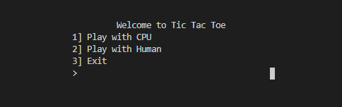
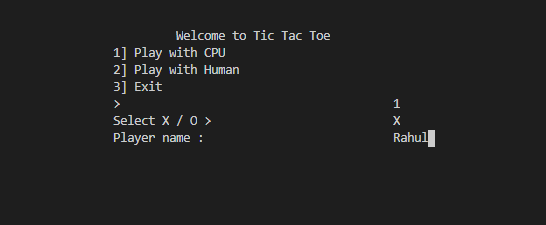
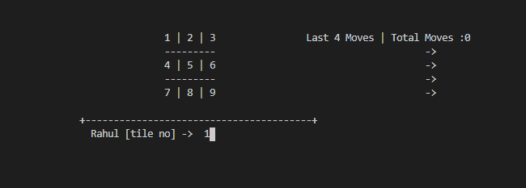
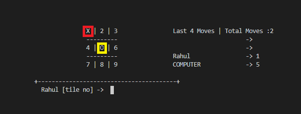
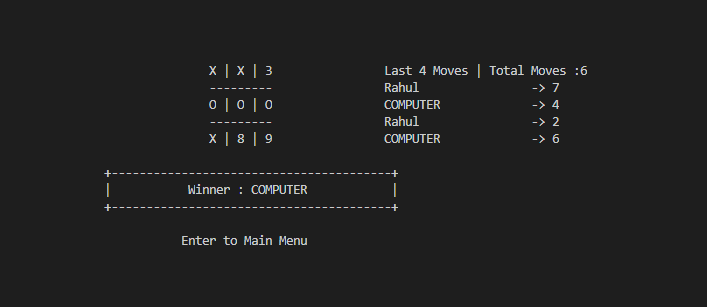
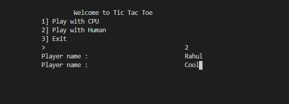
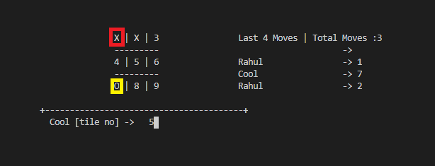
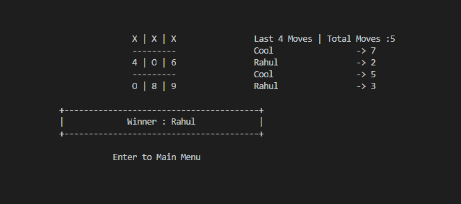

# Tic-Tac-Toe

A Tic Tac Toe Game in Python

It is a two player game, Xs and Os, where player take turn in 3x3 grid.
The player who first place three of their mark in horizontal, vertical or diagonal wins the game.


The game is wriiten in python language. Following is walkthrough of the game.

---

## How to play

> Tic Tac Toe is written in Python 3 so *Python 3* Needed to run the game.

* Open the CMD in the folder

> Here the Tic-Tac-Toe directory is in D drive

```cmd
D:\Tic-Tac-Toe>python TicTacToe.py
```

The menu will appear



> If you want to play with cpu enter option 1.



> You would be asked to choose X or O.



> Then Game will start. You need to enter the position of the tile you want to place X/O.



> At the End,  You will be winner, loser or the match will draw.



> If you want to play with human
> Enter both Player name 1st will get X and 2nd will O.



> You both need to enter the tile number one by one till the game ends.



> At the End,  Match will draw or anyone will wins the game.


